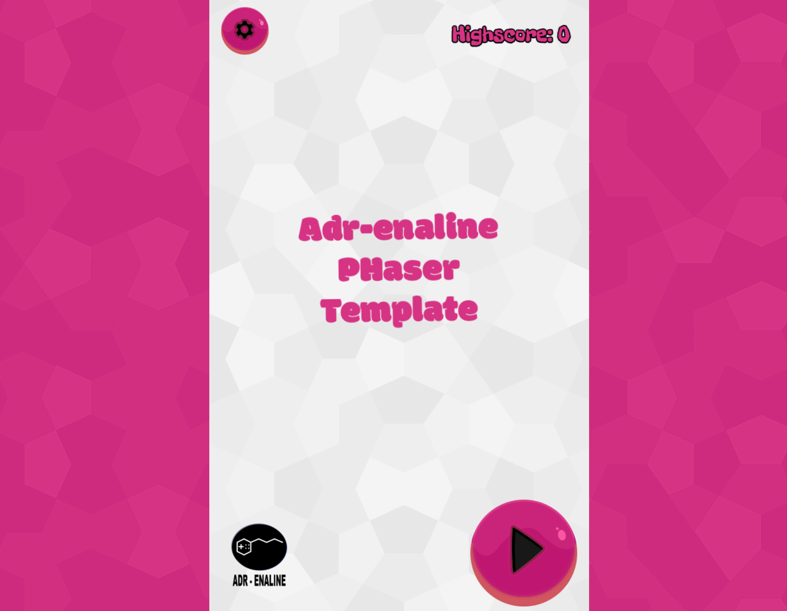

# Adr-enaline Phaser 3 Game Development Template  

Welcome to this Responsive template for web games created using the Phaser 3 game engine, TypeScript and WebPack, designed to help you kickstart your journey into HTML5 game development with Phaser.  

This template provides a solid foundation for creating web games, featuring a modern setup that integrates **TypeScript** and **Webpack**. It is inspired by the Enclave Phaser Template by Andrzej Mazur, with additional enhancements to support streamlined development workflows for developers of all levels.  

## Features  
- **Phaser 3 Integration**: A pre-configured Phaser 3 setup to get you started right away.  
- **TypeScript Support**: Write your game code with type safety and modern development practices, improving maintainability and reducing bugs.  
- **Webpack Configuration**: Efficient build and bundling process, including support for hot module replacement during development and optimized production builds.  
- **Lightweight and Scalable**: Ideal for simple prototypes or scaling up to complex game projects.  
- **Cross-Browser Compatibility**: Ensures your games run seamlessly on modern browsers.  
- **Progressive Web App**: manifest file for Add to Home Screen feature, Service Worker for offline use, and notifications template. 

## Usage  

# Clone the repository and install dependencies:     
   git clone <repository_url>  
   cd <project_folder>  

# add packages
yarn add xxx 
yarn add xxx --dev

# upgrade packages to there latest versions
yarn upgrade

# Install
yarn install

# launch dev mode
yarn dev

# build
yarn build

### Feeling grateful?:

If this template sparks joy in your project or you just appreciate seeing code out in the wild, show some love by [inserting a coin](https://www.paypal.me/T0dl4b4l)—just like in the good old arcade days. 🎮✨ Cheers! 🕹️
